上传文档（音频、图片、文本），如果重复则检测为相同文件，直接报错提示用户。如果文件内容没有重复，则保存文件到本地生成区块，检查内容并保存区块。根据标题、文件名、作者、公钥等信息，生成一个区块从最新的区块开始，顺着链往前查找是否有相似的文档。如果找到相似文档，则直接报错提示用户。如果未找到相似文档，则继续后续步骤保存新生成的区块到区块链。

 

例：首先上传MonaLisa1文件中的图像（图1），填写相应信息，显示成功创建。再上传MonaLisa2（图2）文件中的图像，显示由于检测到类似特征，上传失败。继续上传其他相似度很低的图像（图3），创建成功。

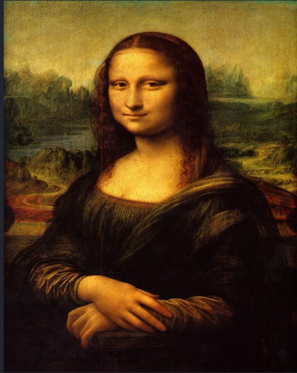

  图1 MonaLisa_1.png    图2 MonaLisa_2.png     图3 other.png

 

**1.** ***\*上传文件。\****进入系统主界面“Home”，此界面中，用户可选取音频、文本、图片进行上传上链。（图4-图5）

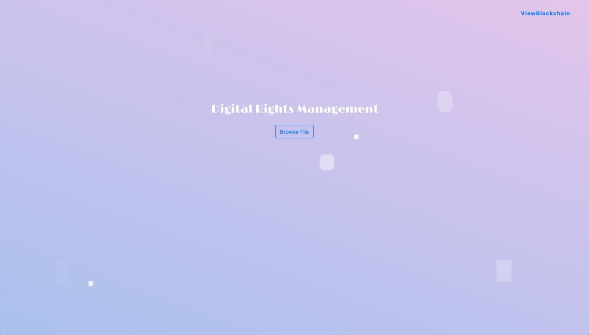

图4 界面1

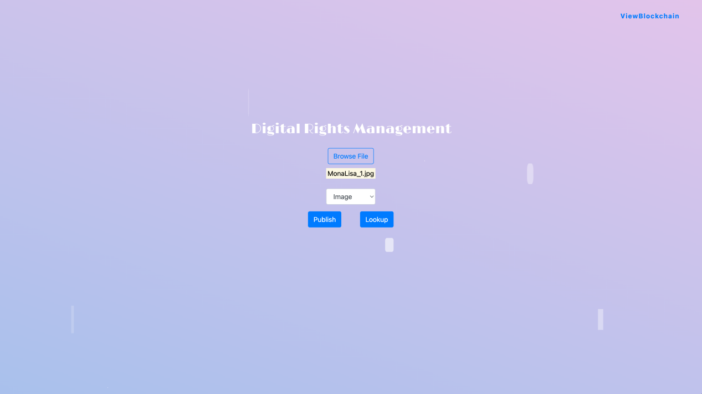

图5 界面2

 

**2.** ***\*链上比对。\****系统识别到图像在本系统链上唯一存在，即可通过创建（图6中右上角绿色标志显示“Object is Unique”，即创建成功）。用户可进一步进行图像命名、作者信息填写以及公钥设置（图7）。

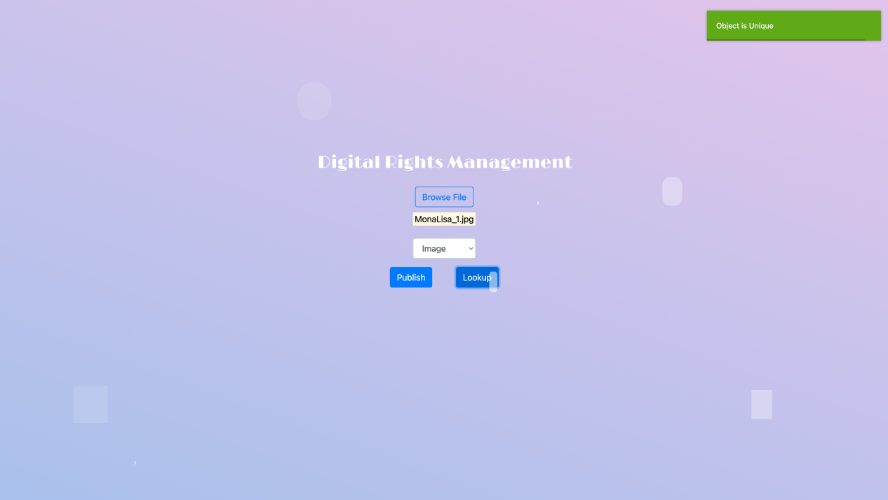

图6 界面3

 

图7 界面4

 

**3.** ***\*文件信息查看。\****在“ViewBlockchain”界面中查看上传成功的文件信息。包括作品名、作者名、文件类型、时间戳、自行创建的公钥，以及文件原始信息（文件原始名以及预览图）。（图8-图9）

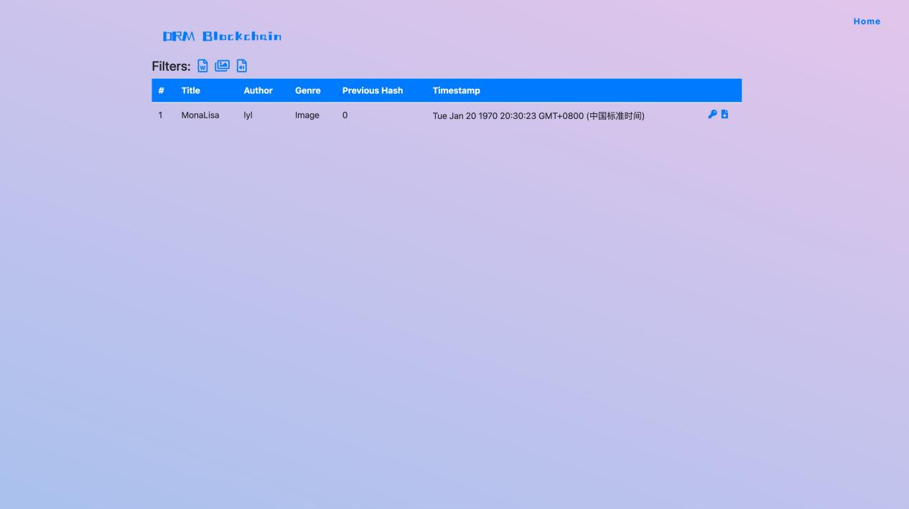

图8 界面5

 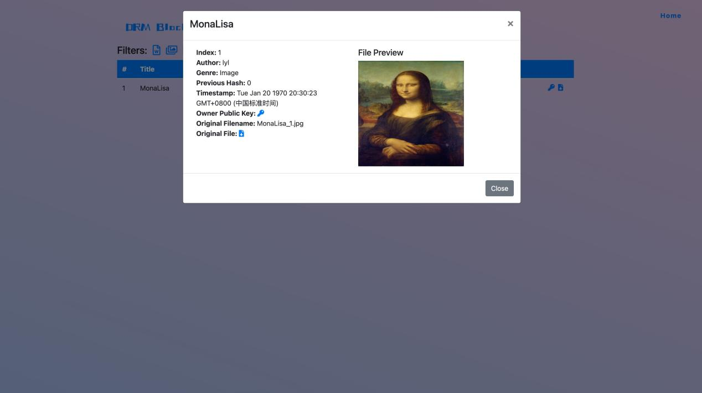

图9 界面6

 

**4.** ***\*作品对比识别及保护。\****若有用户上传与链上作品相似度极高的文件，系统会识别出文件相似，并拒绝上链。此情况下，用户无法成功上传作品。图示测试中的MonaLisa_2.png与已经上链成功受到保护的MonaLisa_1.png相似度极高，仅图片色调和拉伸程度不同。此处保护了首次上传作品的信息安全与版权独一性（图10-图12）。若发生版权纠纷，系统可为用户提供上传信息用以维权。

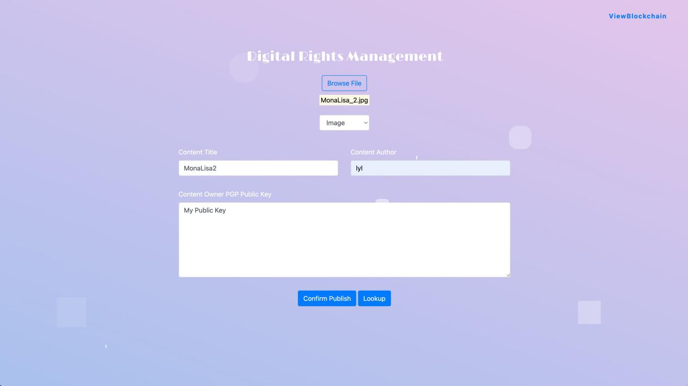

图10 界面7

 

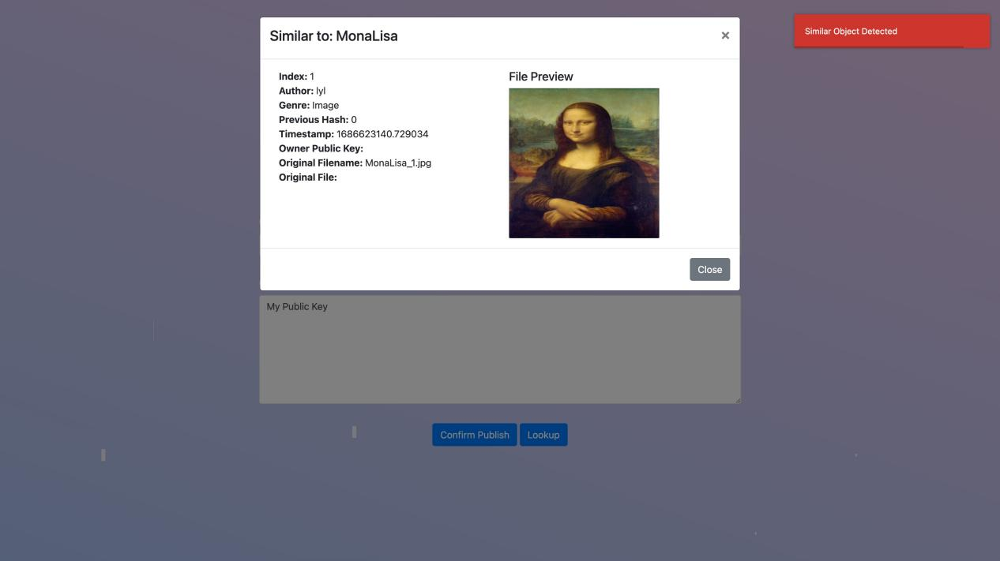

图11 界面8

 

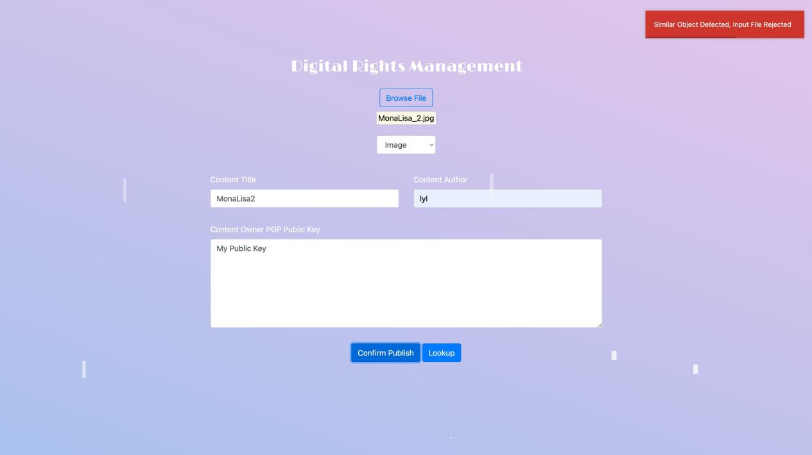

图12 界面9

 

**5.** ***\*智能对比。上传与\****MonaLisa_1.png不同的图像，则可通过验证，成功上传并上链（图13-图14）。此时“ViewBlockchain”界面可以查看过往文件上传信息（图15）。

 

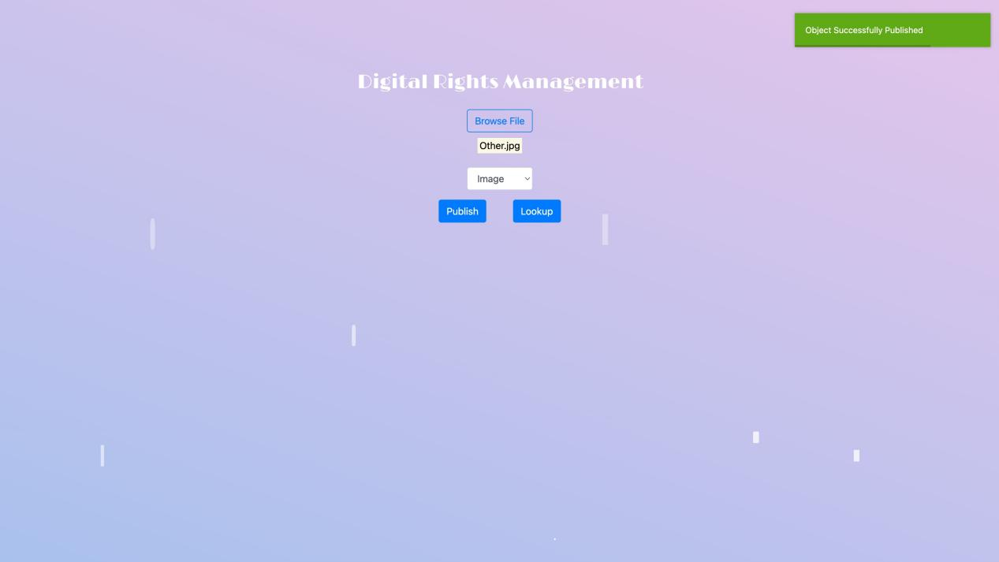

图13 界面10

 

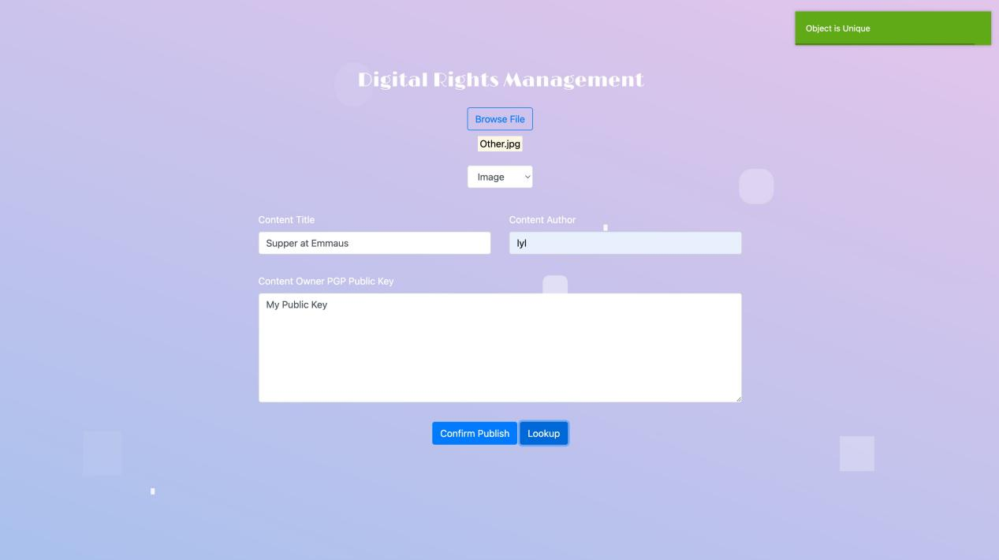

图14 界面11

 

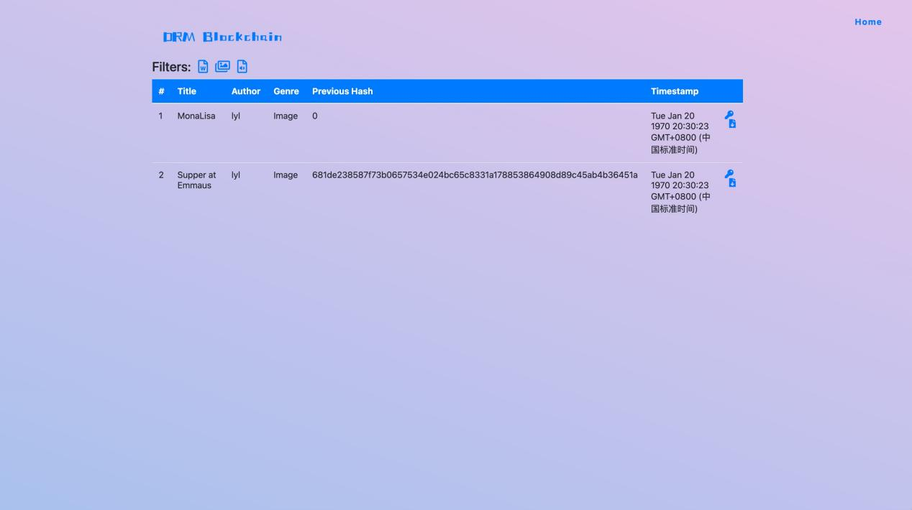

图15 界面12