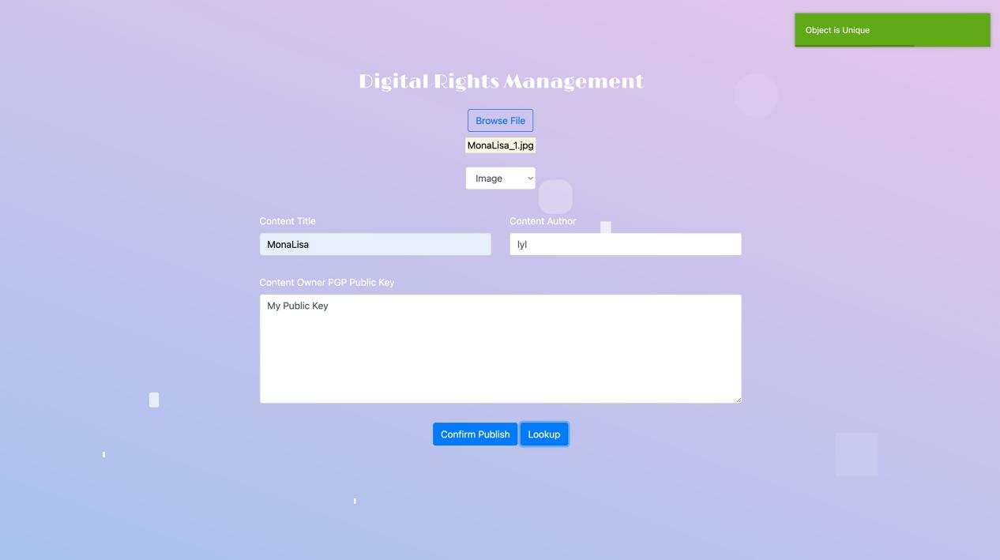

#  Digital Copyright Protection

基于区块链的文档上传与管理系统，支持音频、图片和文本文件的上传，并具备重复检测功能，确保内容的唯一性，保护知识产权。

## 功能概述

- **文件上传**：支持上传音频、文本和图片文件。
- **重复检测**：检测并防止上传重复或高度相似的文件。
- **区块链集成**：将唯一文件存储为区块，确保记录的安全和不可篡改。
- **文件信息管理**：查看已上传文件的详细信息。
- **知识产权保护**：确保上传内容的唯一性，防止版权侵权。

## 工作流程

### 1. 上传文件

进入系统主界面“Home”，用户可以选择音频、文本或图片文件进行上传上链。

  
*图4：主界面1*

  
*图5：主界面2*

### 2. 链上比对

系统检测上传的文件在区块链上是否唯一。如果文件唯一，系统会创建一个新的区块，并显示绿色标志“Object is Unique”，表示创建成功。

  
*图6：创建成功确认*

用户可进一步填写文件名称、作者信息及公钥设置。

  
*图7：文件信息填写界面*

### 3. 查看文件信息

在“ViewBlockchain”界面中，可以查看已成功上传文件的详细信息，包括：

- **作品名**
- **作者名**
- **文件类型**
- **时间戳**
- **公钥**
- **原始文件名**
- **预览图**

  
*图8：查看信息界面1*

  
*图9：查看信息界面2*

### 4. 作品对比识别及保护

当用户上传与链上已有作品相似度极高的文件时，系统会检测到相似性并拒绝上链，确保首次上传作品的信息安全与版权独一性。

**示例：**

- 上传 `MonaLisa1.png` 成功。
- 上传 `MonaLisa2.png` 失败，因为与 `MonaLisa1.png` 相似度高。
- 上传 `other.png` 成功，因为相似度低，系统检测不存在侵权行为。

  
*图10：重复检测1*

  
*图11：重复检测2*

  
*图12：重复检测3*

在发生版权纠纷时，系统可提供上传信息以支持用户维权。

### 5. 智能对比

上传与 `MonaLisa1.png` 不同的图像时，系统通过验证，允许文件成功上传并上链。用户可以在“ViewBlockchain”界面查看过往文件上传的历史记录。

  
*图13：成功上传1*

  
*图14：成功上传2*

  
*图15：区块链历史记录*

## 使用示例

1. **上传 `MonaLisa1.png`**：
   - 填写必要信息。
   - 成功创建新的区块。

2. **上传 `MonaLisa2.png`**：
   - 系统检测到与 `MonaLisa1.png` 相似。
   - 上传失败并提示错误信息。

3. **上传 `other.png`**：
   - 检测到低相似度。
   - 成功创建新的区块。

## 项目参考

[BitRight GitHub 仓库](https://github.com/liuyanqi/bitright)

*注：这是一个多年前的项目，工具配置可能较为困难，但作为学习资源仍然非常有价值。*

